## 1. Overview
 
Markdown is a markup language that is used to help create readme documentation, most notably on Github. The readme documentation serves as a step by step guide on how a project works and can be installed. This is beneficial for both technical and general audiences. It helps new users learn how to work with the software, with the goal of possibly getting new users into the world of computer software.
 
The nice thing about markdown is you can fluctuate between Markdown syntax and HTML. If you've done HTML before, you can supersede some of the concepts for translation.
 
<b>Heads up!</b> I've set this readme as an interactive tutorial. This is to get you used to working with the different functions and syntax that's allowed in markdown. From here, you may also learn some of the basics of how HTML is created.
 
## 2. Getting Started
 
When you begin writing a document of markdown, you first will have to make a new document with the markdown extension. You can either create one on your Github or create a new file on your preferred IDE. All you have to do for your document.
 
<b>Heads Up!</b> For this tutorial, I am using Visual Studio Code. The reasoning for this is I'm able to preview how my document will appear. This helps me see just how I want my document to appear on anything I want it to be displayed at. The most common place you'll see markdown documents is on Github. I'll be using this platform to show you how a markdown file can be seen.
 
To begin a new document
- Go onto your Github.
- On the "Repository Name", call the project "AboutMe"
- Initialize the repository with a Readme.
 
This will create a ready-made document called `ReadMe.md` that will display on the next screen.
 
<br><kbd>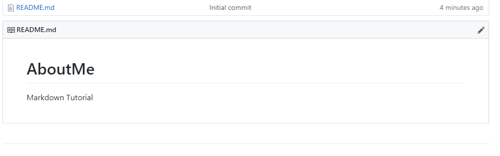<br><i>Figure 2.1: About Readme start.</i></kbd><br>
 
If you click on the edit button, which is indicated by the pencil icon on the top corner of the image, you can see a skeleton of a markdown document. Go ahead and click on the icon.
 
<br><kbd>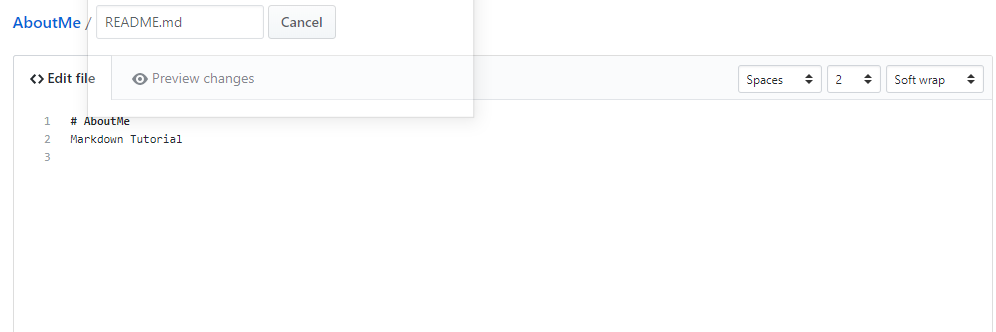<br><i>Figure 2.2: About Readme raw text.</i></kbd><br>
 
You notice how the AboutMe has a bigger text font than the "Markdown Tutorial" text. This is because the AboutMe text is preceded by a heading order that gives it a bigger font, usually indicating a section. We will explore headers in the next section.
 
<b>Heads Up!</b>: I will be cloning this repository onto my client so I can work off of Visual Studio code. You are more than welcome to follow my standard, but you may also edit on the screen and apply the changes as such.  If it is your first time to ever preview README's on VSC here is a [link](https://code.visualstudio.com/docs/languages/markdown) to help you get started. 
 
<details closed>
<summary>If you're editing on Github open here</summary>
As I mentioned before, if you are editing on Github directly for the tutorial, just do the following when you are committing any changes.
 
- Type in or add what you want for your new commits.<br>
- (Optional) Click on the "Preview tab" to see what the document should look like after. Depending on your changes, they may not appear until you submit the changes.
- Click the "Commit Changes" button to update your project. Your changes will appear shortly.
</details>
 
## 3. Headers and Spacing
 
The first part we can start learning about with markdown is headers. You've already seen this in the previous section when you previewed the "About" text on your first created Readme.
 
Headers are important since they tend to signal what a section is all about. Having the appropriate size and if applicable a line spacing indication helps.
 
For example, let's put a new section below about me called "Summary" or "Introduction" about yourself. This doesn't have to be too long, maybe about three sentences or so. put the following below your about
 
`# Summary`
 
The summary will have the same size as your "About" when you preview the result.
<br><kbd>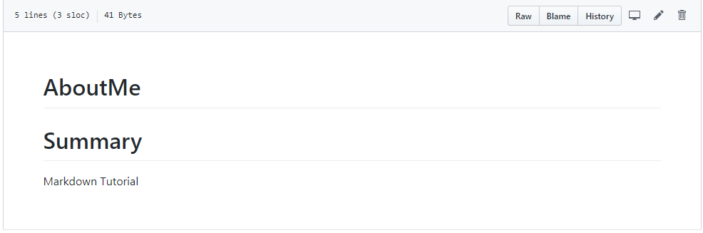<br><i>Figure 3.1: Summary section of AboutMe.</i></kbd><br>
 
 
This looks good, but we want the summary section to be smaller. To get a smaller section "Summary", add an extra '#' to the "Summary" text.
 
`## Summary`
 
Preview and cast your result.
 
<br><kbd>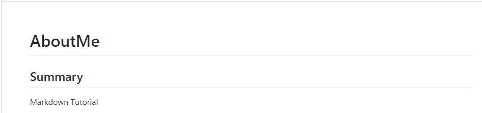<br><i>Figure 3.2: Summary header version 2.</i></kbd><br>
 
Now our section doesn't overwhelm the page. The "AboutMe" stands out as the head part of the document while "Summary" feels like it goes along with the page. Depending on how many '#' you include, the smaller the header will look. See for example with three, four, and five '#'.
 
<br><kbd>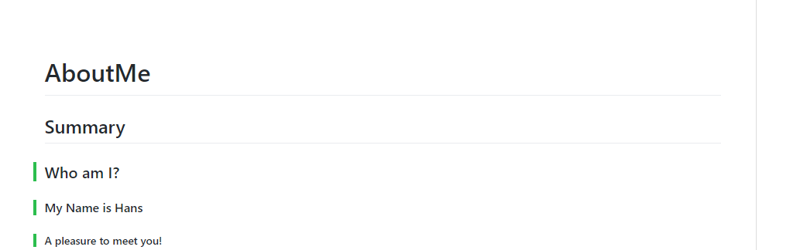<br><i>Figure 3.3: Summary header version 3.</i></kbd><br>
 
You can clear out the last three sections you created, and leave the "Summary" section.
 
<b>Heads Up!</b> You can also do the same thing with the headers by using the `<h1></h1>` approach if you have any exposure to HTML. This is also helpful if you have documents that will be hosted via HTML. Just like the `#` example goes up to `#####`, the `<h1></h1>` goes up to `<h5></h5>`.
 
Underneath the "Summary" section, fill in a short introduction of yourself. Upload the result.
 
<br><kbd>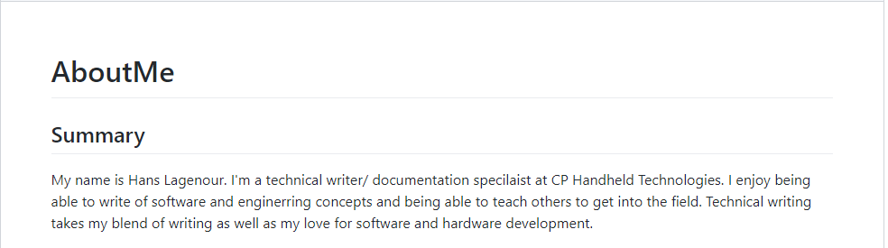 <br><i>Figure 3.4: Summary header version 4.</i></kbd><br>
 
Now finally we want to add two solid lines underneath the "AboutMe" section. We want this to be kept as the head title but appear separate from the page. To add this, add the following underneath:
 
`---`<br>
`---`
 
The preview should look like so.
 
<br><kbd>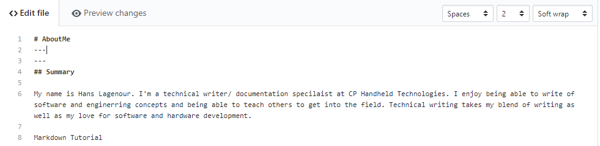<br><i>Figure:</i></kbd><br>
 
And when you submit your commit, This is what you should see.
 
<br><kbd>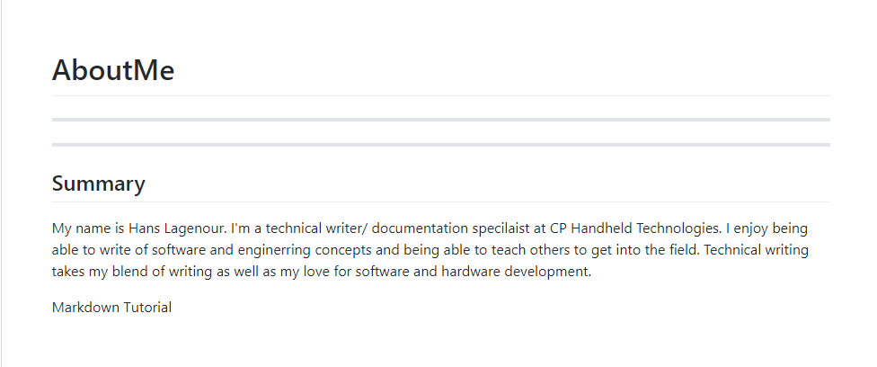<br><i>Figure:</i></kbd><br>
 
<b>Heads Up!</b>: Another way of making header displays is you can just add a `-` underneath what you want as a section or a `=` underneath the text. For example:<br>
 
`Summary`<br>
`=`
 
Will give you a header 1 underlined while a
 
`Summary`<br>
`-`<br>
Will give you a header 2 underline.
 
You'll be adding more sections to the tutorial as we build up your AboutMe ReadMe document.
 
## 4. Bullet Points and Number Lists
 
Markdown also allows for using bullet points and numbered lists. Using bullet points and numbered lists is a great for:
 
- Explaining directions.
- Covering concepts related to a section
- Anything that would be easier to list rather than typed in sentence structure.
 
This section will show you how to add ordered and unordered lists to your document.
 
To begin, we will create a new section underneath `Summary`
 
- Create the new heading for the section called `Hobbies`.
 
   - For making this heading, just type the text `Hobbies` and then underneath the text put a `-`. This will show the header two heading I talked about earlier.
 
<br><kbd>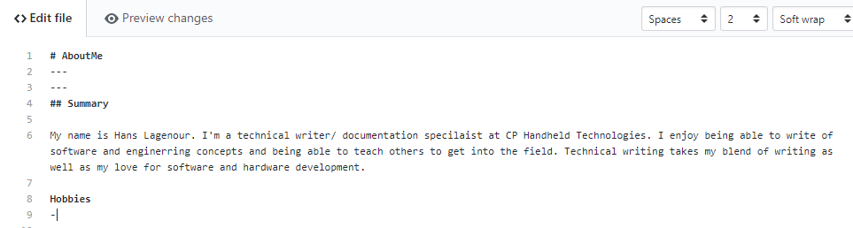<br><i>Figure 4.1: Starting number line raw.</i></kbd><br>
 
You will see the results below:
 
<br><kbd>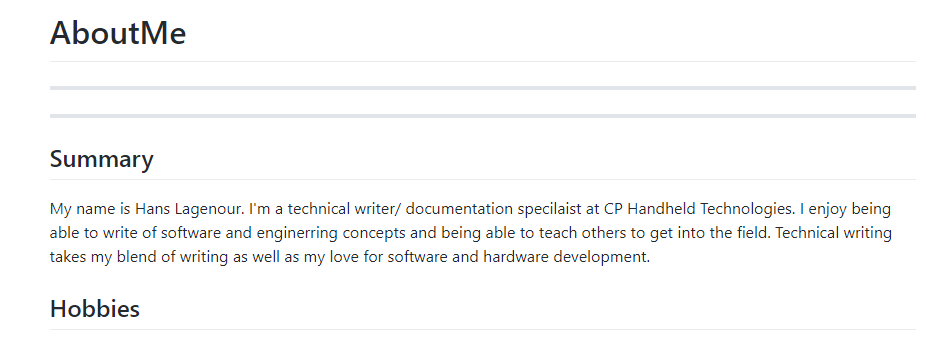<br><i>Figure 4.2: Hobby number line.</i></kbd><br>
 
- List down a couple of hobbies. Put down three for right now.
 
You can create lists by putting a `-`, `+`, or `*` followed by a space will create an unordered list. In my example, I used one of each for my hobbies list.
 
<br><kbd>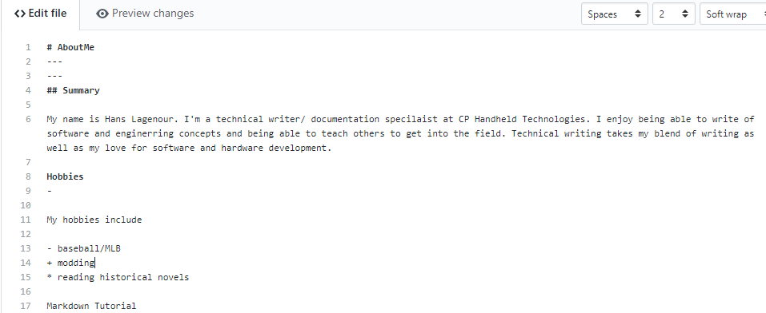<br><i>Figure 4.3: Bullet point raw. text.</i></kbd><br>
 
You don't have to keep your unordered list as mine. You can make your unordered lists with all `-`, `+`, or `*` depending on your preference. It will still turn out the same.
 
<br><kbd>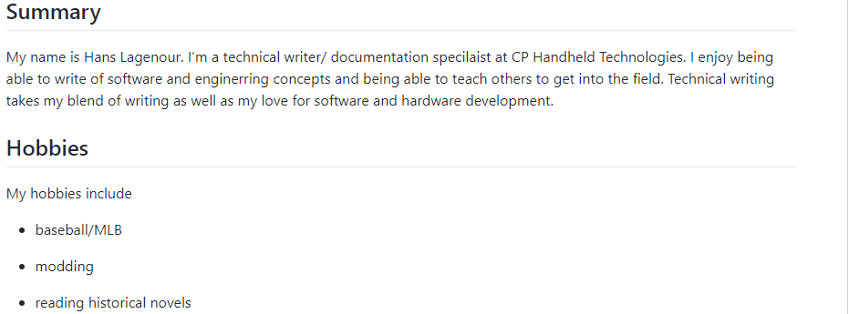<br><i>Figure 4.4: Bullet points on the page.</i></kbd><br>
 
Now if you are wanting to put up numbered lists, all you have to do is "#." where # can be any number. Observe as I add in my night time routine.
 
<br><kbd>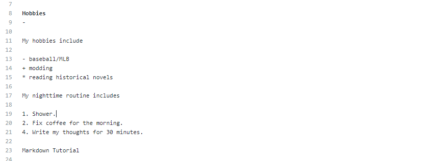<br><i>Figure 4.5: Number lists raw.</i></kbd><br>
 
And my result is this.
 
<br><kbd>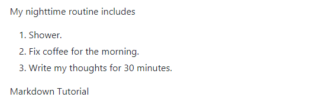<br><i>Figure 4.6: Number lists on page.</i></kbd><br>
 
<b>Heads Up!</b> You notice how I put 1,2 then 4 in the previous example? In Markdown, the actual numbers do not matter. All there has to be is a number.
 
## 5. Emphasis on Text
 
In certain texts that you have already seen in the document, you may have seen some <b>bold</b> text as well as some text <i>that's in italics.</i>
 
Markdown allows its own syntax to be able to use certain emphasis for your text. You'll use the Markdown syntax on the following examples
 
<b>Heads Up!</b> You can also use the HTML text format for some of the examples as well. I'll include how to do them in that as well.
 
We will start with using italics first. This will go below the nighttime routine you created.
 
- Make a new header 2 section with any method you want.
- Call this new section `My Motto` or `My philosophy`
- Write a short sentence or paragraph for this section.
- Wrap that sentence/paragraph with single asterisks or underscores as so. In my example, I wrote two lines with two different wrap arounds.
 
<br><kbd>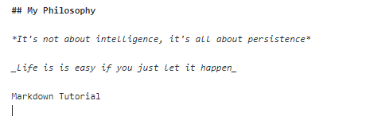<br><i>Figure 5.1: Emphasis additions.</i></kbd><br>
 
Adding either underscores or single asterisks around your text will make your sentence or paragraph appear in italics like so.
 
<br><kbd>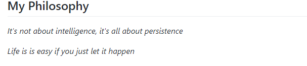<br><i>Figure 5.2: Emphasis additions on the page.</i></kbd><br>
 
We can also do the same tactic with using bold text. Will do this with creating a new section called `Favorite Quotes`
 
- Create a new header 2 section called `Favorite Quotes`
- Type in two quotes you like.
- Bold parts of the words and/or phrases that stick out to you. Use either the double asterisk or double underscore method.
 
In my example, I use both to show you the same results.
 
<br><kbd>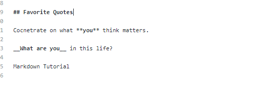<br><i>Figure 5.3: Creating bold text raw.</i></kbd><br>
 
When you commit your changes, you should see something similar.
 
<br><kbd>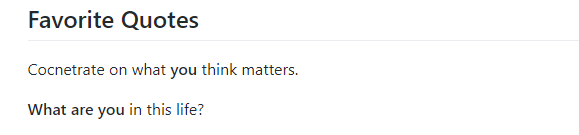<br><i>Figure 5.4: Creating bold text result.</i></kbd><br>
 
If you are used to using html, the bold and italics can also be used with the closing `<b></b>` for bold and `<i></i>` for italics. However, it may not reflect the actual appearance in the document before previewing. Compare the figures below.
 
<br><kbd>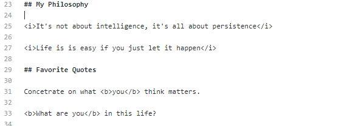<br><i>Figure 5.5: Using html text.</i></kbd><br>
 
But in the preview section, the changes will show.
 
<br><kbd>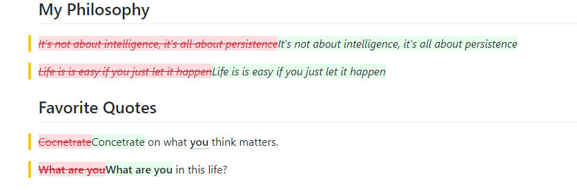<br><i>Figure 5.6: Using html text on result.</i></kbd><br>
 
<b>Heads Up!</b>
Whenever you are adding a bullet point list, always be sure to start on a new line and a space below the last sentence you created.
 
Sometimes markdown will instead make everything above that line into header 2 section font
 
## 6. Including Hyperlinks
 
Markdown allows you to create hyperlinks in two different fashions. You can create hyperlinks as in-line style or create the links as reference style links. The preference is up to you. Against html, there is a slight difference on how you can make the hyperlinks.
 
For this example, you will create a new section for listing your favorite websites.
 
- Create a new section called `My favorite Websites`.
- List your first website that you like to visit with the following syntax:
 
`[this is my link](https://www.favoritewebsite.com)`
 
Below is the first website I list for example.
 
<br><kbd>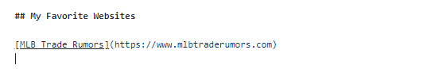<br><i>Figure 6.1: Creating a new link.</i></kbd><br>
 
And this is what appears
 
<br><kbd>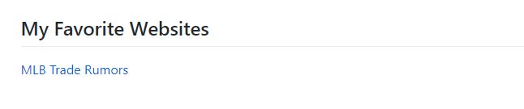<br><i>Figure 6.2: Creating a new link result. </i></kbd><br>
 
You can also add in a title to your links as well this way. For example, maybe I want to add a link that goes straight to a team I like to read about on the same website, the St. Louis Cardinals. You can add in a reference title like so
 
`[this is my link](https://www.favoritewebsite.com "Specific name of website")`
 
You can replace `Specific name of website` with what you consider appropriate.
 
<br><kbd>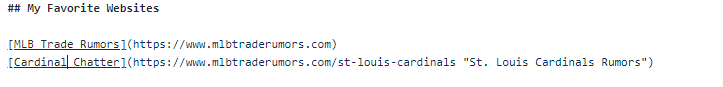<br><i>Figure 6.3: Creating specific links.</i></kbd><br>
 
What I have here in quotation marks `St. Louis Cardinals Rumors` should appear when I hover my link. Commit your changes and test it out.
 
<br><kbd>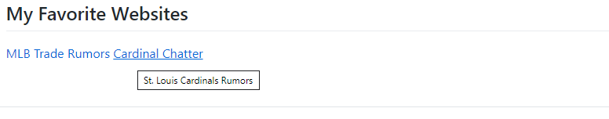<br><i>Figure 6.4: Specific link message.</i></kbd><br>
 
<b>Heads Up!</b> When you are adding links together in a section, make sure to use the `< br >` call. If not, your links will run along the same line instead of creating a new line below.
 
Now the title appears when we hover over the `Cardinals Chatter` link.
 
<br><kbd><br><i>Figure 6.4: Cardinal Chatter message.</i></kbd><br>
 
The other way you can include links is by using reference style. As long as you still remember the tag you give for your reference, you place your links anywhere in a page. This is a great method in case you need to include a lot of links for reference or credit.
 
- Create a new link in your `My Favorite Websites` section. I'm going to call mine `I'm being tagged`
 
<br><kbd>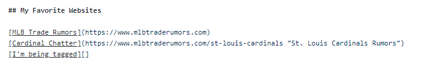<br><i>Figure 6.5: I'm being tagged link redirection link.</i></kbd><br>
 
Now notice how I haven't filled in the `()` section? We will fill this in for our tag.
 
- Inside your second `[]` put in an anchor or tag for reference. Mine will be `I have a new home`.
 
<br><kbd>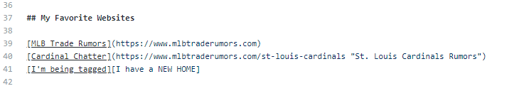 <br><i>Figure 6.6: New link anchor.</i></kbd><br>
 
- Now choose anywhere to place your actual link. I'm going to tag mine right underneath `Summary` which you'll see.
- Type your brackets `[]` and fill it in with your anchor reference.
 
<br><kbd>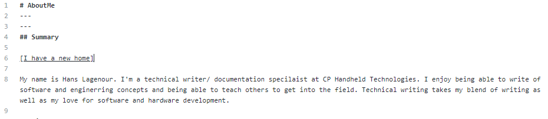 <br><i>Figure 6.7: Reference link anchor.</i></kbd><br>
 
><b>Heads Up!</b> When using a reference-style link in markdown, you don't have to worry about case sensitivity. As long as the text matches, the anchor/tag will work just fine.
 
- After the text you put inside your `[]` place a colon after it.
- Type in the address that you want that link to go to.
 
<br><kbd>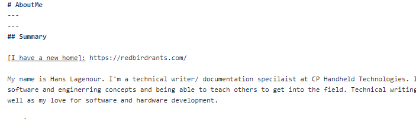<br><i>Figure 6.8: The new link address.</i></kbd><br>
 
Now commit the changes and see the results. You can also look at where you put your reference tag and it will not show up in the final document.
 
<br><kbd>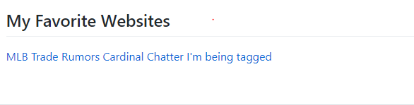<br><i>Figure 6.9: All three links created.</i></kbd><br>
 
When you highlight over the link, you should see the redirected address below. In my example, mine goes to Redbirdrants.com
 
<br><kbd>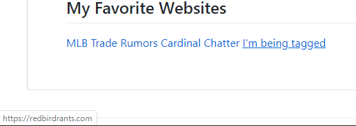<br><i>Figure 6.10: Redirect to correct website.</i></kbd><br>
 
Just as you can reference links with reference text, you can also do the same with numbers. You can think of this when you read a book, and it has references to the appendix.
 
For this example, I'm going to list my favorite people of influence I like to read about. This time I will do it by number reference.
 
- Create a new section called `Persons of Interest`
- Grab the link from who you choose. For example, I grabbed a Wikipedia article on Abraham Lincoln.
- Type out your brackets `[]` and put inside the person's page you choose.
- put another bracket right next to the one you created. Put in any number that you like. In this case, I put `1`.
 
<br><kbd>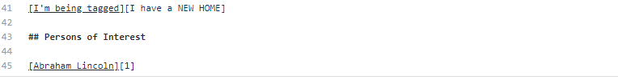<br><i>Figure 6.11: Link addition using a number.</i></kbd><br>
 
- Choose a location for putting your number references. Mine will go in the `Summary` section.
- Just like before, place your brackets `[]` and the number you are using for reference.
- Add a colon and paste your link.
 
<br><kbd>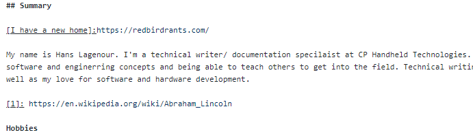<br><i>Figure 6.12: Putting link down for number association. </i></kbd><br>
 
Now when you commit your changes the results should be the same as the previous demonstration. The number reference should still catch the link you pasted, so long as it's active.
 
<br><kbd>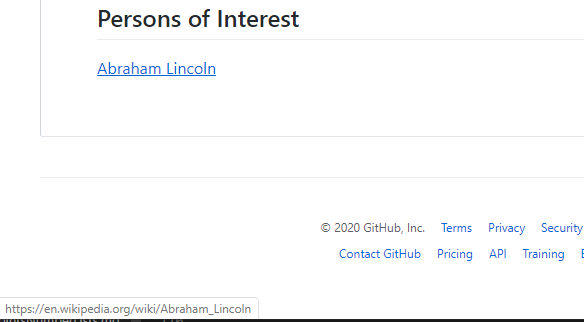<br><i>Figure 6.13: Link to Abraham Lincoln.</i></kbd><br>
 
You can do this for as many people or links as you would like to add. I added two more people followed by breaking points just to emphasize the point.
 
<br><kbd>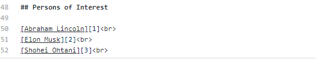<br><i>Figure 6.14: More links by number association.</i></kbd><br>
 
With the correct reference numbers
 
<br><kbd>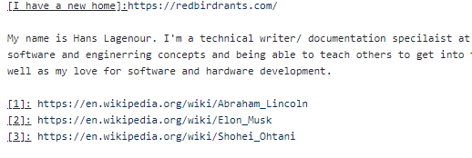<br><i>Figure 6.15: Links to Elon Musk and Shohei Ohtani</i></kbd><br>
 
And when committed gives me my desired results.
 
<br><kbd>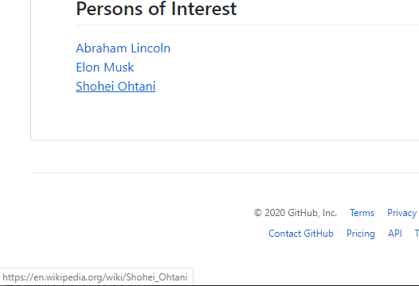<br><i>Figure 6.16: Correct links going to the right location. </i></kbd><br>
 
<b>Heads Up!</b> URLS and angle bracket `<>` will be turned into links automatically. However, if you just put the name of the website and its ending but without the `www`, it may not turn into a link.
 
## 7. Images
 
Adding images into your README's is a great way to help break up the text. It also helps illustrate a concept or layout of a design where words may not be the best option. I'll show you a couple of ways to add in images in markdown.
 
<b>Warning</b>
 
I tend to use a different method when I am adding images. This is due to my documentation having to be in various places and trying to keep everything in one format.
 
When you are placing an image you want to use, you'll need it to be in your repo and be able to call from it. For those persons of interest section earlier, I want to use an image for their link.
 
Before displaying our images, create a new folder in your repo and call it `img`. This where you will store the images you have displayed.
 
- Create a new folder on your desktop. Call it `img`.
- Download an image you would like to use.
- Add it to your `img` directory.
- On your github repo, click `Upload Files`
- Drag in your `img` folder and the image included.
 
<br><kbd><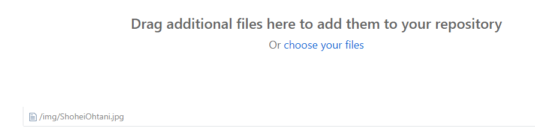<br><i>Figure 7.1: Dropping image file.</i></kbd><br>
 
- Commit your files and see the result.
 
<br><kbd>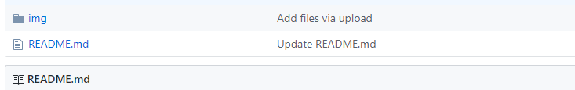<br><i>Figure 7.2: Image uploaded. </i></kbd><br>
 
Now we can start adding images from within your repository. I'm going to start with mine by adding Shohei Ohtani to his respected link. How you add images in markdown works a couple of ways. This first one works as an inline style. <br>
 
``
 
I've placed my image to appear here.
 
<br><kbd>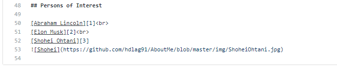<br><i>Figure 7.3: Adding image of Shohei Ohtani placement.</i></kbd><br>
 
And the result I get is this:
 
<br><kbd>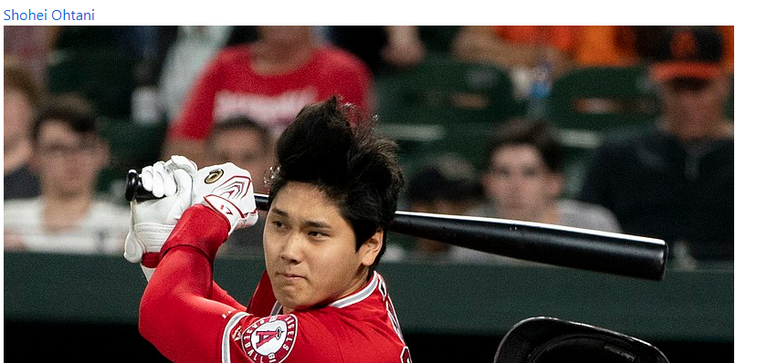<br><i>Figure 7.4: Shohei Ohtani.</i></kbd><br>
 
Although I like this, I want to reduce the size. Markdown allows you to reduce the size if you decide to use HTML style tags for images. I'm going to do this to change the size to a smaller scale.
 
- Reopen your edit screen
- Replace your `` with the following:
 
``
 
You can enter your preferred dimensions in `height` and `weight` for your image. I'll be using 100 and 200 respectively. I'll also be adding a breaking line for Shohei's image to appear below his link.
 
<br><kbd>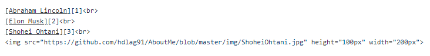<br><i>Figure 7.5: Setting height and width of image. </i></kbd><br>
 
Committing the result, I get the following image.
 
<br><kbd>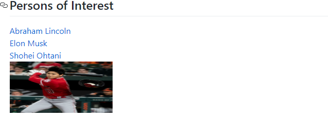<br><i>Figure 7.6: New size of Shohei Ohtani image. </i></kbd><br>
 
I'm also going to do that for the other two persons of interest I have on here. I won't be editing their dimensions since I like the size for both of them and breaking lines for the links.
 
<br><kbd>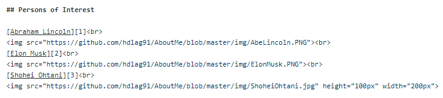<br><i>Figure 7.7: Adding image files of both Abe Lincoln and Elon Musk.</i></kbd><br>
 
And when I commit my changes:
 
<br><kbd>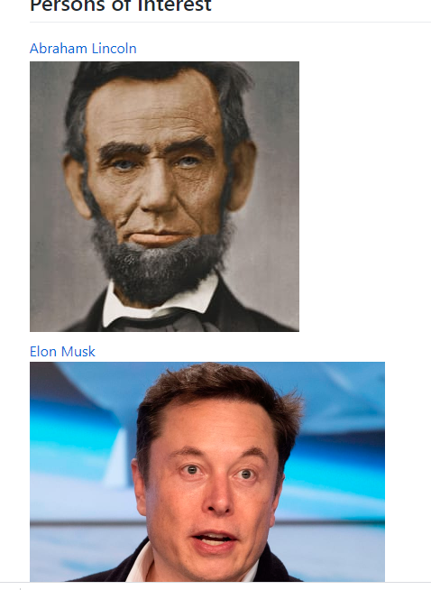<br><i>Figure 7.8: Abe and Elon uploaded.</i></kbd><br>
 
### 8. Adding Borders
 
You can also add borders to an extent in markdown. You can surround the image that you desire with the `<kbd>` tag. This will give some pop to your image and not divert the reader too much on the documentation.
 
I'm going to do this for all the images I have so far. Choose and image and have the `<kbd>` and `</kbd>` surrounding the image/images of your choice.
 
<br><kbd>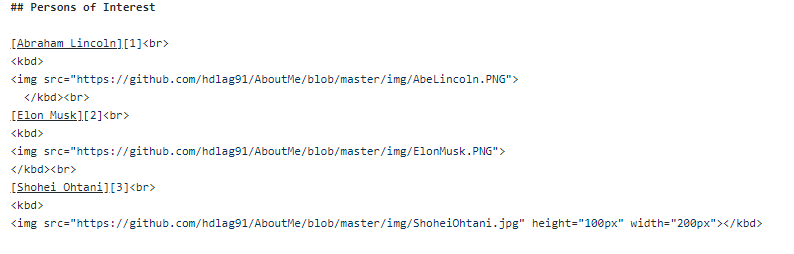<br><i>Figure 8.1: Creating image border.</i></kbd><br>
 
Now when you make your commits, you will have a noticeable background to your images. If you think you have to, and some breaking lines to your images as well.
 
<br><kbd>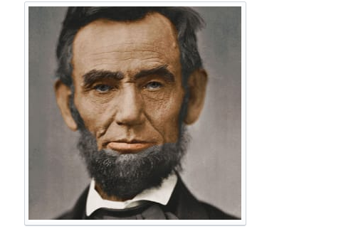<br><i>Figure 8.2: image border applied. </i></kbd><br>
 
The contrast helps when adding in figures for your work as well.
 
## 9. Tables
 
Markdown allows a way for adding in tables for users. In this case you can list data and definitions that would fit better in this format versus in sentence or bullet-point structure.
 
For example, let's say you are wanting to build a table that is holding your favorite terms. This could be regarding computer science or terms you like to use as well as trying to explain.
 
- Create a new section underneath your AboutMe called `CS Terms` or `Terms`
 
To create a table you will do the following:
```
| Table Name |
| ---        |  
|Column 1 name|
|Column 2 name|
|Column 3 name|
|Column 4 name|
```
<b>Heads Up!</b>
 
When you are creating a table, you need at least one <b>-</b> underneath your table name. You may have it stretched to the name of your table, but it will still stretch out to your table name.
 
- For now, just create one column. Call the Column `Terms`.
- List down your favorite terms you like to talk about. I have my example below.
 
<br><kbd>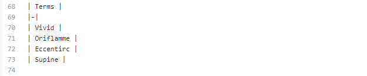<br><i>Figure 9.1: First table creation.</i></kbd><br>
 
 
Now I did not add any more <b>-</b> except for the required 1. Most of the users will add either three <b>---</b> or enough dashes to underline the table name.
 
<br><kbd>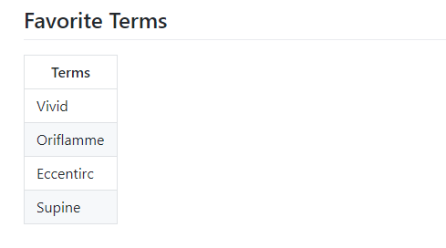<br><i>Figure 9.2: First table layout.</i></kbd><br>
 
Congrats! You've got your first table. But let's fix up the alignment. You are allowed to have your text left, center, or right justified when in a table. For our first column, we want to justify the text from the left.
 
- Go into your document and open the editing menu.
- In your row with the <b>-</b> tag, put a colon over to the left and right before the first <b>|</b> like in the example below.
 
<br><kbd>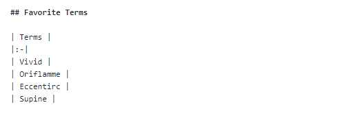<br><i>Figure 9.3: Adding left-sided justification.</i></kbd><br>
 
This will render your text in a left-justified position.
 
<br><kbd>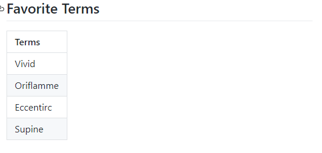<br><i>Figure 9.4: Left-sided justification of text.</i></kbd><br>
 
Adding a second column in Markdown at first may not make sense to you at first. the syntax intuitively doesn't line up the way you would think, but does work. This will work for our second column which we will call <b>Definitions</b>
 
- In the same line that you have <b>Terms</b> for, add the text <b>Definitions</b> after the last pipe character.
- Close the <b>Definitions</b> column with a pipe <b>|</b>.
- Add another dash <b>-</b> section underneath and on the same line as your first dash.
- Close the second dash section with a dash, just like with the second table name.
 
<br><kbd><br><i>Figure 9.5: Creating second column.</i></kbd><br>
 
When you commit your changes, you will have a new column. It will be empty but have the same amount of text boxes as your previous column.
 
<br><kbd><br><i>Figure 9.6: Second column appearance.</i></kbd><br>
 
Now you can fill in the information for the columns. The syntax follows the exact same sequence.
 
<br><kbd><br><i>Figure 9.7: Adding second column text.</i></kbd><br>
 
Under the <b>Definitions</b> column, let's change the font to be central.
 
- Open your edit selection.
- Go to your second column.
- Put colons <b>:</b> before both you pipes <b>|</b>.
 
<br><kbd><br><i>Figure 9.8: Second column with central justification.</i></kbd><br>
 
This will allow you to have a centered text for anything that is put in the second column. When you commit you change, you will have the following.
 
<br><kbd><br><i>Figure 9.9: Second column with central justification appearance.</i></kbd><br>
 
When you wrap the dashes around with the two colons, you generate the center-justified text.
 
Finally, let's add one more table. The definitions I gave for my favorite words are straight from the definition. What I want is a column of what I think the word means.
 
- Create a new table called <b>My Meaning</b>
- Make the text right-justified by adding a colon to the last pipe <b>|</b>
- Using the same methods previously, generate your text on what you think the words mean to you.
 
<br><kbd><br><i>Figure 9.10: Third column with right justification.</i></kbd><br>
 
You can probably guess what this is. On your third column over, you should now have a new column where the text on the right side is justified. When you save and commit your readme file, it should look like this.
 
<br><kbd><br><i>Figure 9.11: Third column with right justification appearance.</i></kbd><br>
 
## 10 Summary
 
From this tutorial, you should now understand the basics of being able to add in everything that you would need to readme files using markdown. This includes using images, creating headers, and adding code snippets into your files. Some of the later lessons really only need to be applied when we get near the end of your documentation. And no matter what, we will always have to comb over it again.


